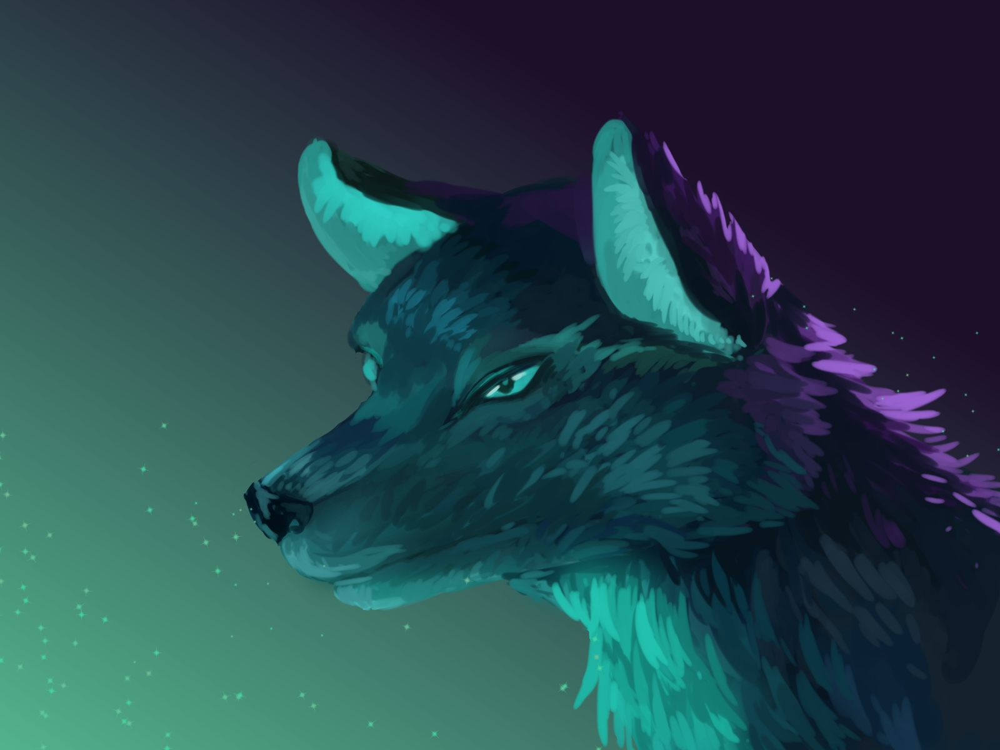

# ggeni.github.io (Beanie)

Beanie is a website mainly build for academic purpose only 

## Welcome to Beanie
Feel free to look at [Beanie](https://ggeni.github.io/index.html) to contribute to the website analysis 

## Attention
The contents within the website may be fictional and not based on real information from the owner.

Do not change or alter the information in the branches.

## Hidden links
a href="WomanCap.html" class="image fit"></a>

a href="WildInst.html" class="image fit"></a>

a href="Mythical.html" class="image fit"></a>

a href="Resting.html" class="image fit"></a>

a href="Horizon.html" class="image fit"></a>

